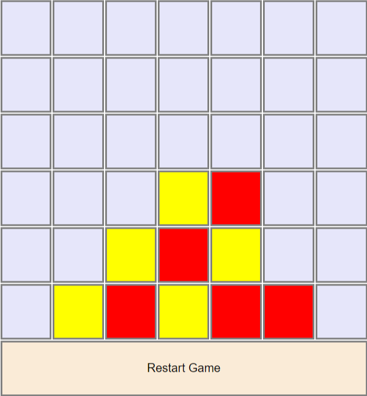
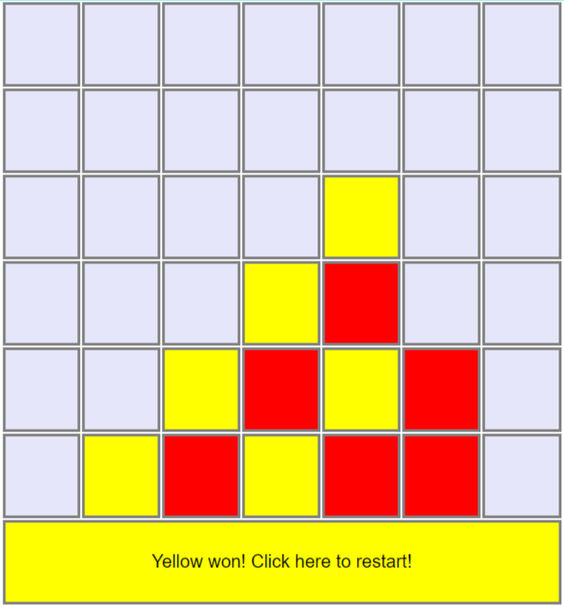
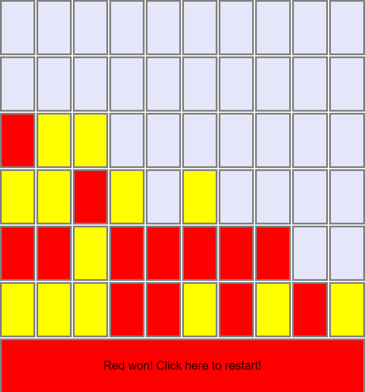

# Connect Four built via React

 

**Settings:** The game board size could be edited easily by updating the variables in the state of Game component. Just update: *tableHeight*, *tableWidth*, *numberOfConnection*.

For example, if you would like to make a *Connect Five* game on a 6x10 board:

 **Questions asked during the interview**:
 - How to make it 3-player?
 - How to add an undo button?
 - How to efficiently organize data id the board was huge?
